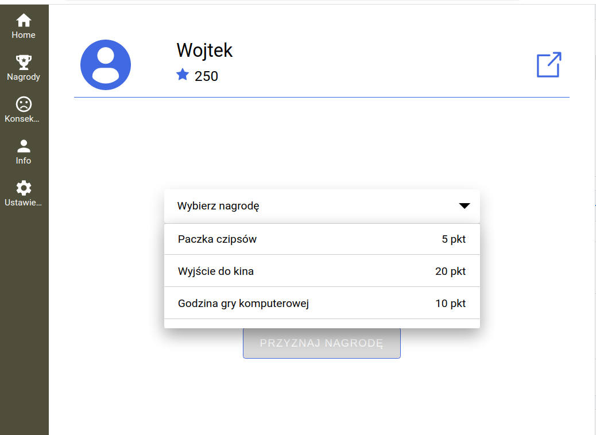
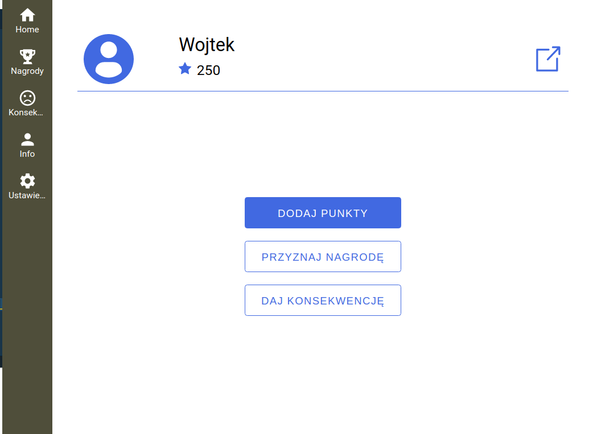
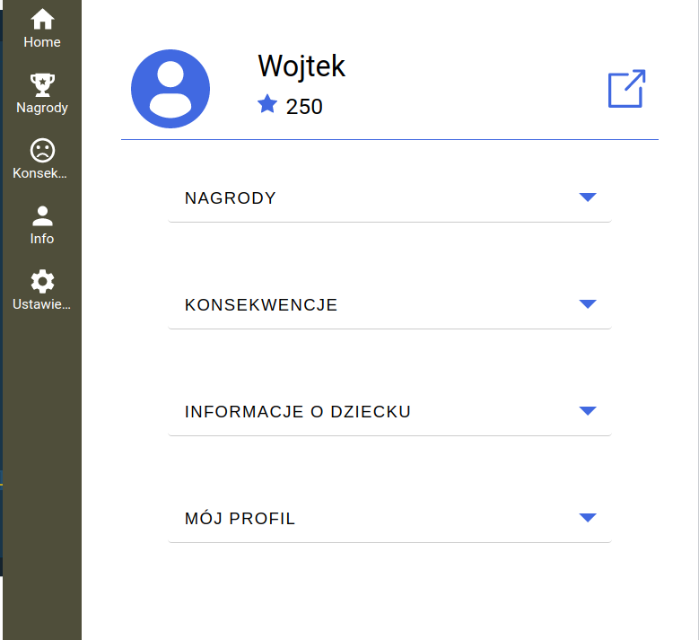
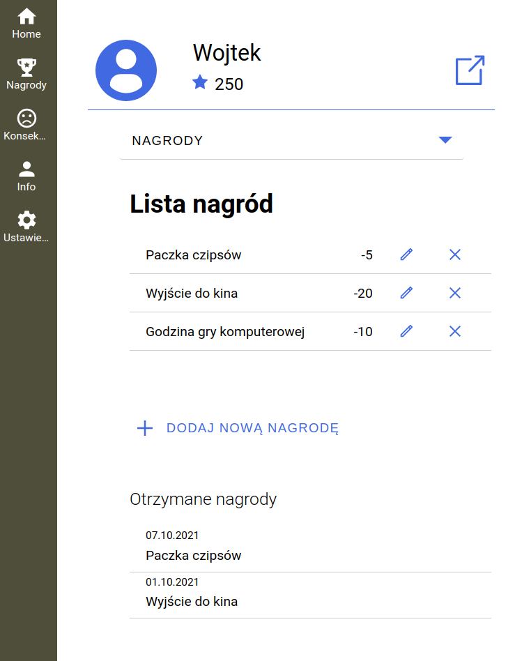
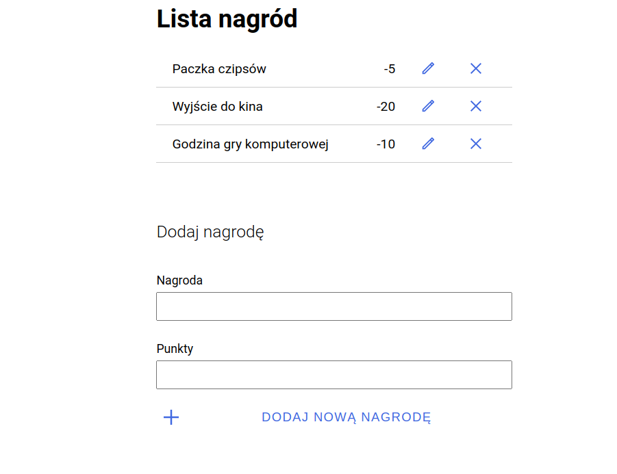
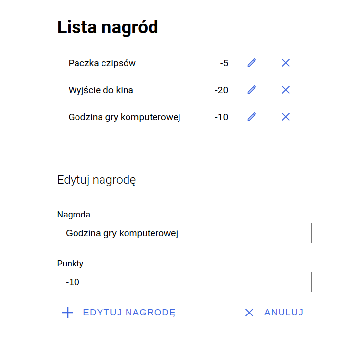
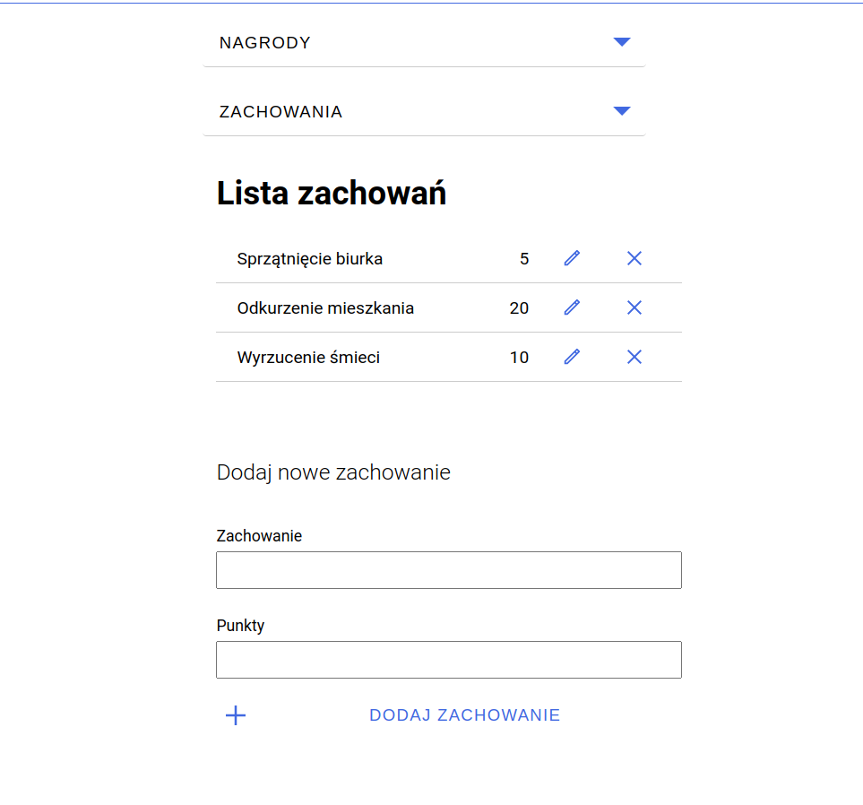
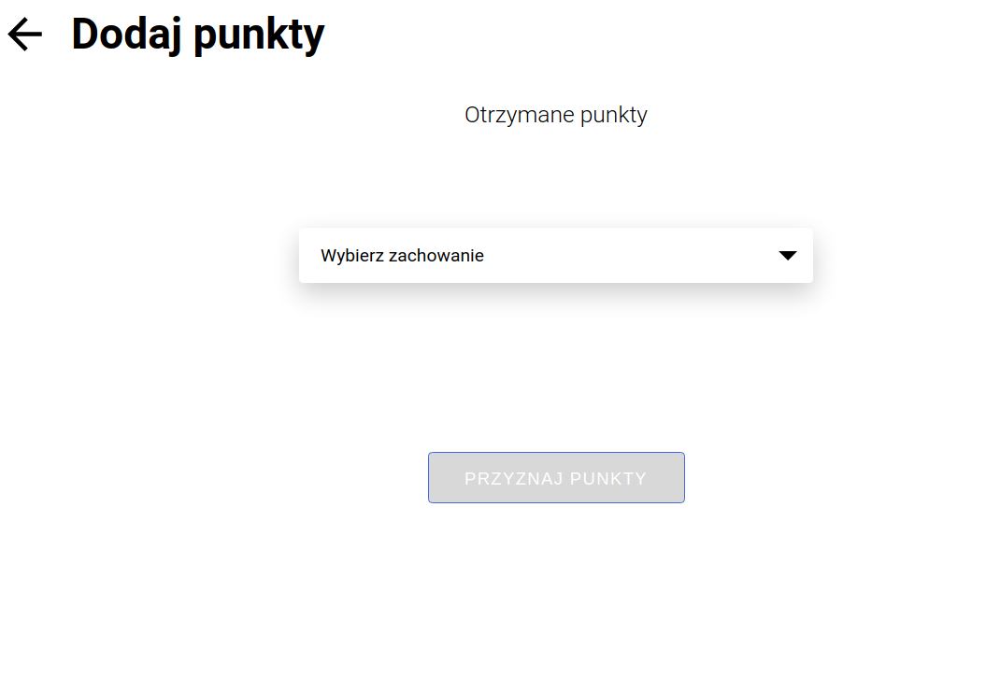
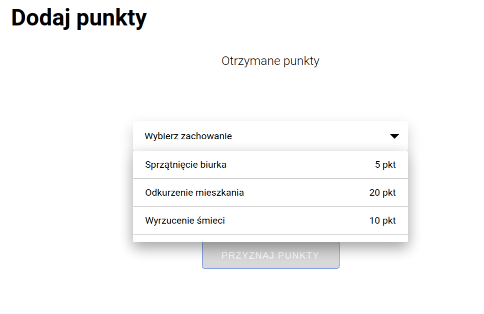
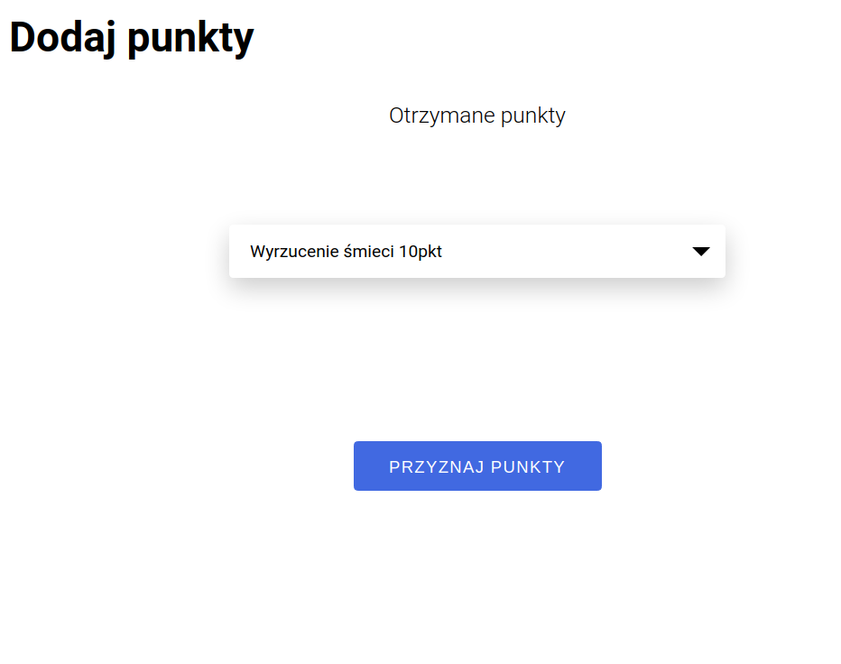

https://zetonteam.github.io/zeton_react/

# zeton_react

Zeton is an application that support behavioral therapy.
Token system for the child.
Allows you to earn points for your activities and exchange them for prizes.

## Application goals

- Developing deficit (desirable) behaviour
- Reduction of undesired behaviour
- Generating and maintaining therapy effects over time

## Development setup

This project was bootstrapped with [Create React App](https://github.com/facebook/create-react-app).

## Setup node environment

To install dependencies, run:

### `npm install`

## Available Scripts

To list every command, run: `npm run`

In the project directory, you can run:

### `npm start`

Runs the app in the development mode. 
Open [http://localhost:3000](http://localhost:3000) to view it in the browser.

The page will reload if you make edits. 
You will also see any lint errors in the console.

### `npm test`

Launches the test runner in the interactive watch mode. 
See the section about [running tests](https://facebook.github.io/create-react-app/docs/running-tests) for more information.

### `npm run build`

Builds the app for production to the `build` folder. 
It correctly bundles React in production mode and optimizes the build for the best performance.

The build is minified and the filenames include the hashes. 
Your app is ready to be deployed!

See the section about [deployment](https://facebook.github.io/create-react-app/docs/deployment) for more information.

---

## Project UI

For styling we use [Styled Components](https://styled-components.com/)

Install the package of styled-components in your project directory with:

`npm install --save styled-components`

---

## Store container

For keeping state we use [Redux](https://redux.js.org/).

<!-- Install Redux Toolkit in your project directory with:

`npm install @reduxjs/toolkit` -->

Next install Redux core library:

`npm install redux`

And..

`npm install react-redux`

---

### `npm run eject`

**Note: this is a one-way operation. Once you `eject`, you can’t go back!**

If you aren’t satisfied with the build tool and configuration choices, you can `eject` at any time. This command will remove the single build dependency from your project.

Instead, it will copy all the configuration files and the transitive dependencies (webpack, Babel, ESLint, etc) right into your project so you have full control over them. All of the commands except `eject` will still work, but they will point to the copied scripts so you can tweak them. At this point you’re on your own.

You don’t have to ever use `eject`. The curated feature set is suitable for small and middle deployments, and you shouldn’t feel obligated to use this feature. However we understand that this tool wouldn’t be useful if you couldn’t customize it when you are ready for it.

## Learn More

You can learn more in the [Create React App documentation](https://facebook.github.io/create-react-app/docs/getting-started).

To learn React, check out the [React documentation](https://reactjs.org/).

### Code Splitting

This section has moved here: https://facebook.github.io/create-react-app/docs/code-splitting

### Analyzing the Bundle Size

This section has moved here: https://facebook.github.io/create-react-app/docs/analyzing-the-bundle-size

### Making a Progressive Web App

This section has moved here: https://facebook.github.io/create-react-app/docs/making-a-progressive-web-app

### Advanced Configuration

This section has moved here: https://facebook.github.io/create-react-app/docs/advanced-configuration

### Deployment

This section has moved here: https://facebook.github.io/create-react-app/docs/deployment

### `npm run build` fails to minify

This section has moved here: https://facebook.github.io/create-react-app/docs/troubleshooting#npm-run-build-fails-to-minify

### How it works

#### Prizes

1. Pick a prize:

There are two places to get to this mode.

- Click on the `Nagrody` button in the navbar. (After adding all pages it should work from every page)
- Or in Student's panel click on `Przyznaj nagrodę` button.

2. Prizes - edition mode

- Go to `Ustawienia` in the Navbar
  

- Click the first bar: `Nagrody`
  

- To add new prize fill in the form: `Dodaj nową nagrodę`
  

- To edit prize, click pen icon and fill the form below:
  

- To delete prize, click x icon

3. Tasks and points settings - click on Ustawienie in the sidebar (footer on mobile) and go to Zachowania
   

Here you can see all the tasks and points, add new ones, edit existing or delete them in the same way as it was shown in "Prizes" section.

4. Add points section - go to student's panel and choose `Dodaj punkty` button
   

- now you can see all the tasks and points that student can receive for completing the task by clicking `Wybierz zachowanie` on the select bar/button

  

- you can see a list of behaviours/tasks and points

  

- after selecting the task/behaviour you can click `Przyznaj punkty` button to add points for compliting the task.

  
